# *Machine-learning trading bot*
---

**Welcome to my repository for the ML trading bot. Please explore the codebase!** <br />

---
## Analytical Summary

This project presents a trading algorithm to automatically trade assets. The models used for the trading are a support vector machine model and a logistic regression.

---

## Technologies

This project leverages python 3.7 with the following packages:

* [pandas](https://pandas.pydata.org) - Library for reading/writing csv files and fast manipulation with DataFrames.

* [numpy](https://numpy.org/) - Library for working with vectors.

* [pathlib](https://docs.python.org/3/library/pathlib.html) - Library for filesystem paths.

* [hvplot](https://hvplot.holoviz.org/) - Library for data exploration and visualization.

* [matplotlib](https://matplotlib.org/) - Library for visualization.

* [sklearn](https://scikit-learn.org/stable/) - Library for predictive-data analysis.
---

## Installation Guide

Before running the application first install the following dependencies.

```python

  pip install pandas
  pip install numpy
  pip install pathlib
  pip install hvplot
  pip install matplotlib
  pip install -U scikit-learn

```
---

## Usage

To use this project simply clone the repository and run the code **machine_learning_trading_bot.ipynb** in JupyterLab or in VS Code.

---

## Methodologys
This project helps a financial advisor to increase the speed for buying and selling stocks. It evaluates two different models, support vector machine and logistic regression and also tunes the parameters for the baseline trading algorithm.

BASELINE MODEL:
The baseline model sets 3 months as the length of the training dataset:

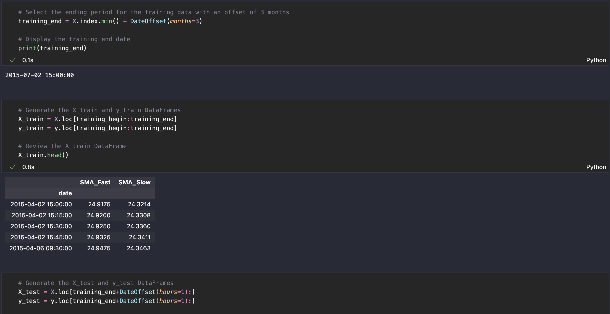

and assumes the fast and slow simple moving averages, 4 and 100 days, respectively:
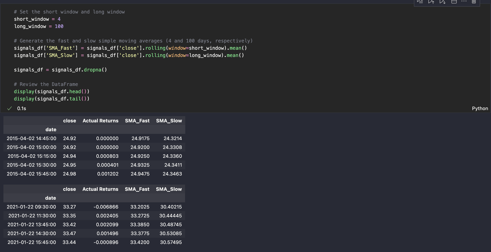

The classification report for this benchmark model is following:

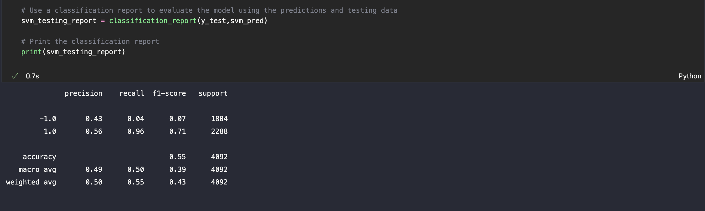

and the plot of the cumulative returns is:

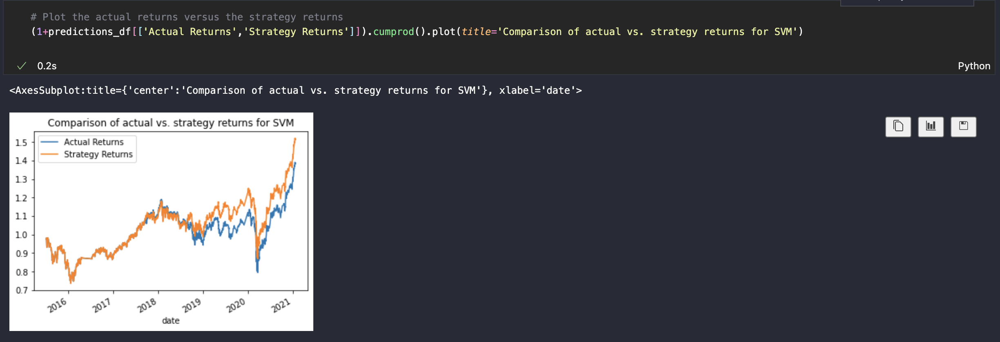

MODEL WITH LONGER TRAINING SET:
If we extend the training set to 6 months:

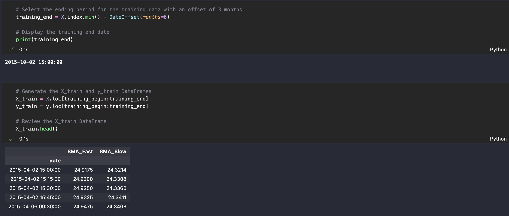

the overall accuracy increases:

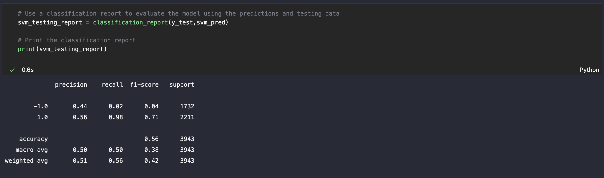

however, the cumulative strategy returns would be lower than actual returns in 2019:

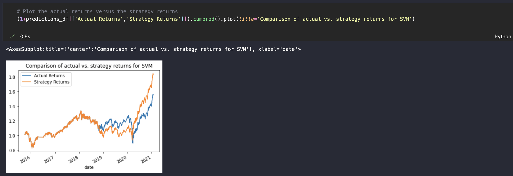

MODEL WITH SHORTER WINDOWS FOR SMA:
If we shorten the windows for the SMAs:

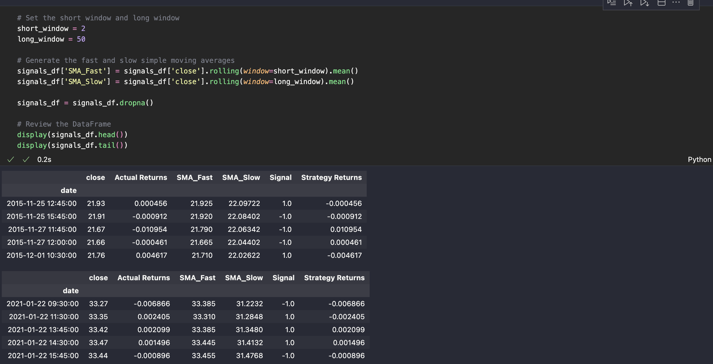

the accuracy becomes smaller than for the original version:

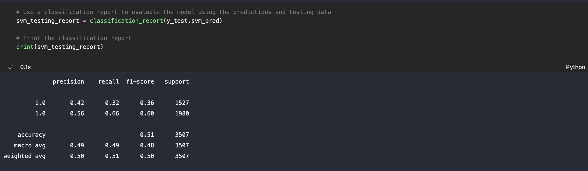

and the cumulative strategy returns deteriorate:

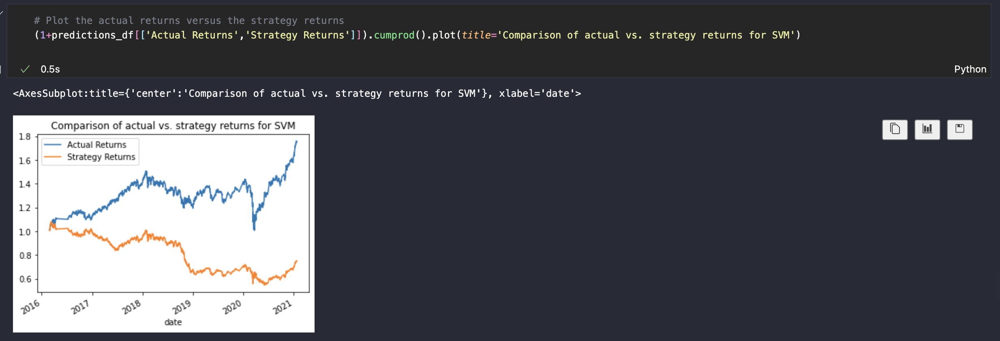

MODEL WITH LONGER WINDOWS FOR SMA:
If instead, we extend the windows for the SMAs:

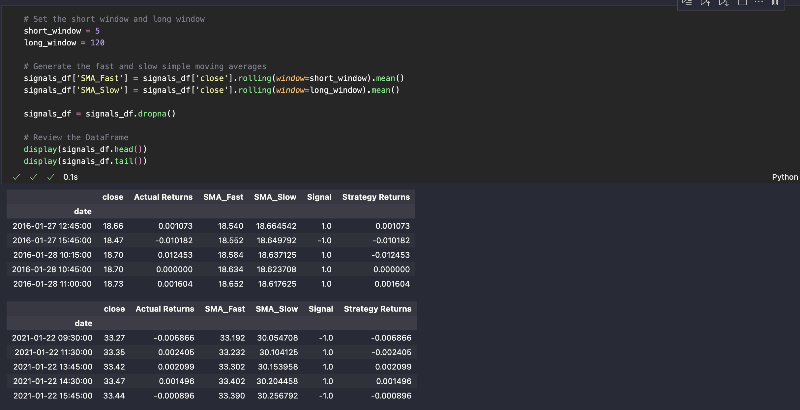

The accuracy increases with respect to the original version:

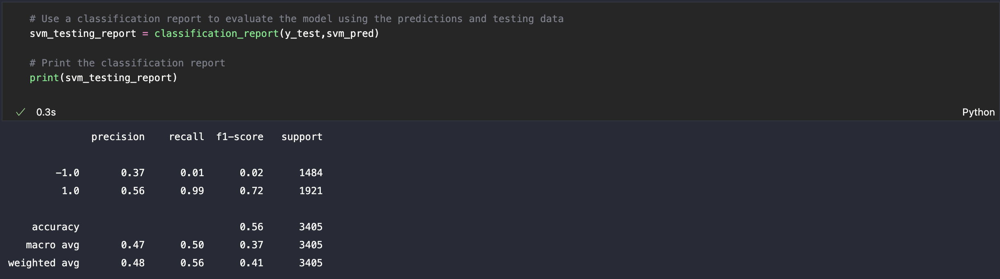

but the cumulative strategy returns decrease:

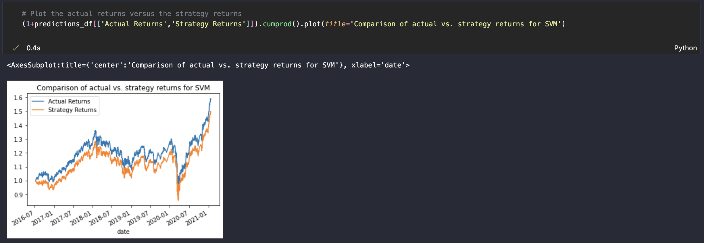

For this parameter tuning, the original version seems to be the best one in terms of increasing cumulative strategy returns.

LOGISTIC REGRESSION:
Finally, we compare the accuracy of the SVM model with the logistic regression.

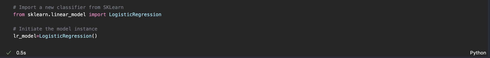

The accuracy is smaller for the logistic regression:

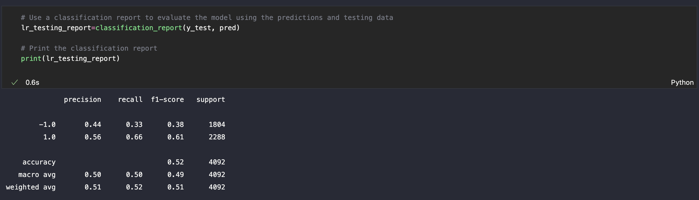

and strategy returns become more volatile

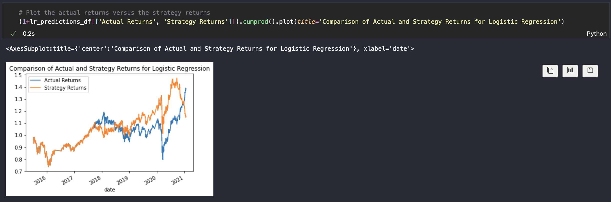

For these reasons, the baseline model is the more preferable version in terms of strategy returns. The version with the longer training set and the version with the longer windows for SMA are the preferable ones in terms of forecasting accuracy.

---

## License

MIT

---


 
